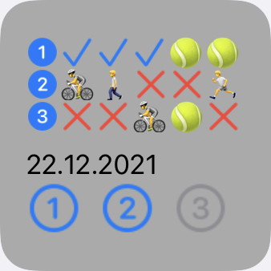
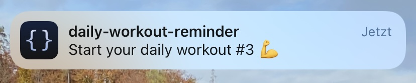
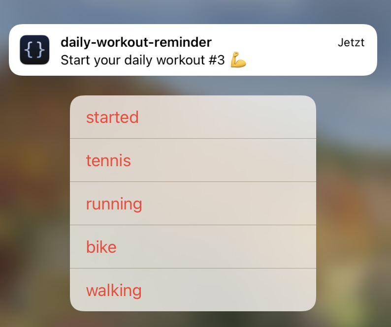

# :muscle: daily-workout-reminder-widget

This widget reminds you of your daily workouts and tracks them.

## Widget Design

The widget is split into three parts. The top part displays the status of the workouts that were tracked over the past 5 days. The number at the beginning of each line indicates the workout count. Next, the status for the previous workout day is shown. The status is color or image coded. A blue :heavy_check_mark: indicates that the workout was completed. A red :x: indicates that the workout was skipped. Further, workouts such as walking (:walking:), running (:runner:), biking (:bike:) or playing tennis (:tennis:) are image coded.</br>
The middle part displays todays date.</br>
And the bottom part shows the status of todays workouts. These are color coded:
* Gray indicates that the workout was not started yet.
* Dark gray indicates that the current workout state is pending.
* Green indicates that the workout was started.
* Blue indicates that the workout was completed.
* Red indicates that the workout was skipped.

</br></br>

## Functionality
This widget reminds you of your daily workouts via notifications at the beginning and end of each workout and tracks if you completed or skipped the workout and what kind of workout you performed.</br>
At the beginning and end of each workout a notification is send:</br>
&nbsp;&nbsp;
</br>
You can interact with the notifiction to provide information about your current workout status.</br>
You can ignore the notification. This changes the workout status to pending. If an end notifiction is send, but the start notifiction is still unanswered, the start notification is removed.</br>
If you dissmiss a start notification, the workout status changes to not-started. Dissmissing an end notification indicates that you skipped the workout.</br>
A long press on the notification, provides the following actions:</br>
&nbsp;&nbsp;
</br>
A normal press on the notification opens the following UI. You are asked, if your started/finished your workout. In case you provide no as an answer, you are further asked, if you did a different workout. Here you can select a specific workout choice.
&nbsp;&nbsp;
</br>
In case you provide a specific workout in response to a start notification, the end notification will not be send.

## Requirements
* Apple Device with iOS 14.
* Scriptable latest (https://scriptable.app/).

## Setup
1. Copy the source code for ```daily-workout-reminder.js``` ("raw").
2. Open Scriptable.
3. Select "+" and insert the copy of the script.
4. Choose the title of the script (e.g. Daily Workout Reminder).
5. Save with "Done".
6. Go back to the iOS Homescreen and get into the "wiggle mode".
7. Press the "+" symbol and look for "Scriptable".
8. Choose widget size (small) and "Add widget".
9. Go into the settings of the widget to edit it.
   * Choose script of step #4.

## Further Config Parameter
The top part of the script sets default config parameter. Those are:
* locale: Specifies the locale for formatting the current date
* shortcutNameHomeScreen: Specifies the name of the shortcut that redirects back to the homescreen. The shortcut must be created in addition, or it can be left empty/undefined.
* startTimes: Specifies the start times of each workout. The length of the underlying array determines the amount of workouts per day
* duration: Specifies the duration for each workout

**Enjoy the widget!**